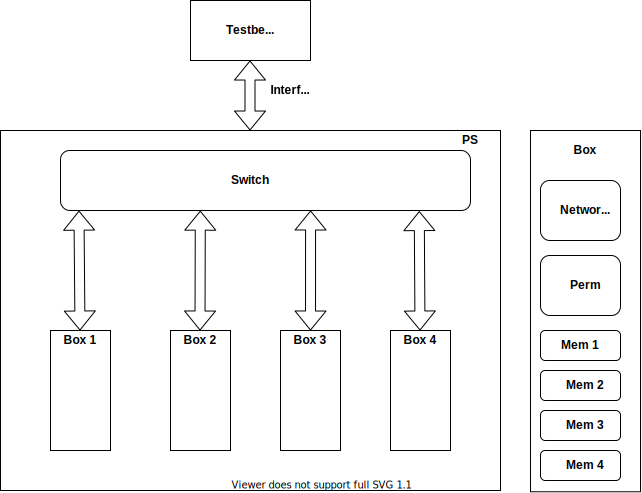

272_finalproject

In this project, I created a Network Switch based on the specification given, and connected it to four SHA3-256 permutation engine devices that I have created in a previous project. The switch takes in data via an interface using modports for input and output, and four boxes instantiated in the switch.   
A box is a module that connects the individual signals of respective interface to the peripherals inside.
Inside each box are four 1600-bit memories, a Network on Chip (NOC) Bus, and a permutation engine.   
The NOC bus is part of a different project I had created in the past that is being integrated here.   
The switch also returns the data back from these four boxes to the testbench.   
For doing the return path, arbitration is required.  
For this design, a Priority Arbiter is implemented, but other arbitration can be easily implemented based on requirement.  
Each box is also attached to a fifo in the switch to store any data coming out while the other box has the bus.  

Thus, the Switch succesfully creates a communication channel for the permutation engine.

In the second revision, the fifo depth was reduced from 256 bytes to 64 bytes. This was done to reduce memory consumption. To achieve this, I had to add a priority round robin arbiter for selecting the high priority signals first out of the fifo.

In the third revision, the fifo depth was reduced to 32 bytes. This was achieved by using two priority round robin arbitration schemes that synchronously work each request and grant access to the bus. A state machine controls the arbiters.

This is a rough architecture diagram of the project

